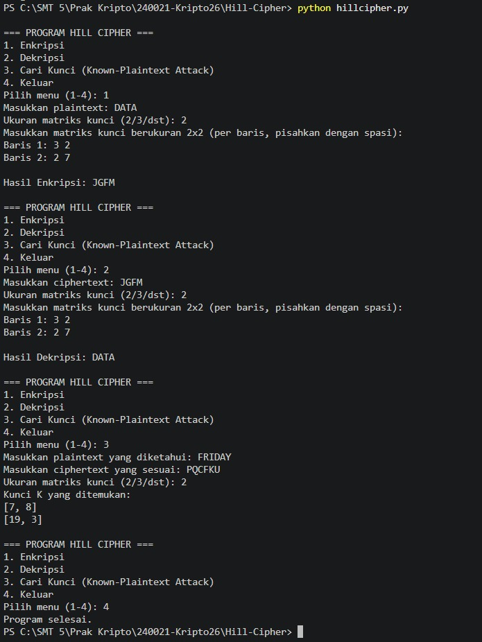

# Hill Cipher

Program ini merupakan implementasi Hill Cipher untuk melakukan enkripsi, dekripsi, dan mencari kunci berdasarkan plaintext dan ciphertext yang diketahui.

## Alur Program

Program memiliki 4 menu utama:

1. **Enkripsi**
   Pengguna memasukkan plaintext, ukuran matriks kunci, dan matriks kunci. Program kemudian mengubah huruf menjadi angka dengan aturan A=0 sampai Z=25, membagi plaintext menjadi beberapa blok sesuai ukuran matriks, melakukan perkalian matriks dengan kunci, lalu mengubah hasilnya kembali menjadi huruf.

2. **Dekripsi**
   Pengguna memasukkan ciphertext, ukuran matriks kunci, dan matriks kunci. Program mencari invers dari matriks kunci modulo 26, kemudian menggunakan invers tersebut untuk mengubah ciphertext kembali menjadi plaintext.

3. **Cari Kunci**
   Pengguna memasukkan plaintext dan ciphertext yang diketahui serta ukuran matriks. Program membentuk matriks plaintext dan ciphertext, kemudian mencari matriks kunci menggunakan rumus:

   `K = C × P⁻¹ mod 26`

   Matriks plaintext harus memiliki invers modulo 26 agar kunci dapat ditemukan.

4. **Keluar**
   Program berhenti dan keluar dari menu.

## Screenshot Running Program

