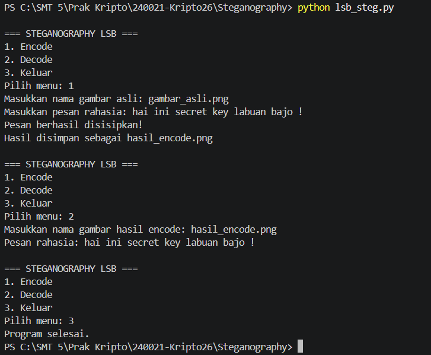

## Deskripsi

Program ini merupakan implementasi steganografi menggunakan metode **Least Significant Bit (LSB)**. Pesan rahasia berupa teks diubah terlebih dahulu menjadi bentuk biner, kemudian setiap bit pesan disisipkan pada bit terakhir dari nilai pixel gambar.

Program memiliki dua fungsi utama:

* **Encode** → menyisipkan pesan rahasia ke dalam gambar.
* **Decode** → mengambil kembali pesan rahasia dari gambar hasil encode.

Metode LSB dipilih karena perubahan pada bit terakhir nilai pixel hanya menyebabkan perubahan nilai sebesar 1 sehingga perubahan pada gambar relatif kecil dan sulit terlihat secara langsung.

## Cara Kerja Program

### 1. Encode

Pada proses encode, program melakukan beberapa tahap:

1. Meminta pengguna memasukkan nama atau path gambar asli.
2. Gambar dibuka menggunakan library Pillow dan dikonversi ke format RGB.
3. Pengguna memasukkan pesan rahasia.
4. Setiap karakter pada pesan diubah menjadi representasi biner 8-bit.
5. Bit `00000000` ditambahkan sebagai penanda akhir pesan.
6. Program mengambil seluruh pixel gambar dan menghitung kapasitas penyimpanan berdasarkan jumlah channel RGB.
7. Setiap bit pesan disisipkan pada bit LSB dari nilai channel pixel.
8. Gambar hasil penyisipan disimpan dengan nama `hasil_encode.png`.

Contoh perubahan bit:

```text
Nilai awal : 11001010
Pesan bit  :        1
Nilai baru : 11001011
```

Perubahan tersebut hanya mengubah nilai pixel sebesar 1.

### 2. Decode

Pada proses decode:

1. Program meminta pengguna memasukkan nama gambar hasil encode.
2. Gambar dibuka dan dikonversi ke RGB.
3. Program mengambil nilai LSB dari setiap channel RGB.
4. Bit-bit tersebut digabungkan menjadi rangkaian biner.
5. Rangkaian biner dibaca setiap 8 bit sebagai satu karakter.
6. Proses berhenti ketika menemukan `00000000` sebagai penanda akhir pesan.
7. Pesan rahasia ditampilkan pada terminal.

## Menu Program

Saat program dijalankan, terdapat tiga pilihan:

```text
=== STEGANOGRAPHY LSB ===
1. Encode
2. Decode
3. Keluar
```

* **1. Encode** digunakan untuk menyisipkan pesan ke dalam gambar.
* **2. Decode** digunakan untuk mengambil pesan dari gambar hasil encode.
* **3. Keluar** digunakan untuk mengakhiri program.

## Library yang Digunakan

Program menggunakan library:

```python
from PIL import Image
```

Library **Pillow** digunakan untuk membuka, memproses, dan menyimpan gambar.

Jika Pillow belum terpasang, jalankan:

```bash
pip install pillow
```

## Menjalankan Program

Jalankan program melalui terminal dengan perintah:

```bash
python lsb_steg.py
```

Kemudian pilih menu sesuai kebutuhan.

### Contoh Encode

```text
=== STEGANOGRAPHY LSB ===
1. Encode
2. Decode
3. Keluar

Pilih menu: 1
Masukkan nama gambar asli: gambar.png
Masukkan pesan rahasia: Halo ini pesan rahasia
Pesan berhasil disisipkan!
Hasil disimpan sebagai hasil_encode.png
```

Program akan menghasilkan file:

```text
hasil_encode.png
```

### Contoh Decode

```text
=== STEGANOGRAPHY LSB ===
1. Encode
2. Decode
3. Keluar

Pilih menu: 2
Masukkan nama gambar hasil encode: hasil_encode.png
Pesan rahasia: Halo ini pesan rahasia
```

## Screenshot Running Program




## Kesimpulan

Program berhasil menerapkan metode **Least Significant Bit (LSB)** untuk menyembunyikan pesan teks ke dalam gambar dan mengambil kembali pesan tersebut melalui proses decode. Penyisipan dilakukan pada bit terakhir dari setiap channel RGB sehingga perubahan pada gambar sangat kecil.
