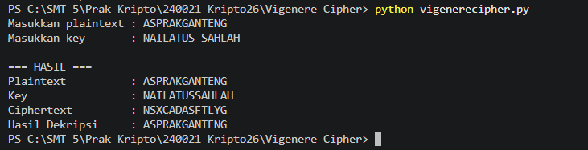

# Vigenere Cipher

Program ini merupakan implementasi **Vigenere Cipher** menggunakan bahasa pemrograman Python. Program dapat melakukan proses **enkripsi dan dekripsi** menggunakan plaintext dan key yang dimasukkan oleh pengguna.

## Alur Program

Program terdiri dari tiga bagian utama, yaitu fungsi `enkripsi()`, fungsi `dekripsi()`, dan fungsi `main()`.

### 1. Input Plaintext dan Key

Program meminta pengguna memasukkan plaintext dan key.

* **Plaintext** adalah teks yang akan dienkripsi.
* **Key** adalah kunci yang digunakan dalam proses enkripsi dan dekripsi.

Pada tugas ini digunakan:

```text
Plaintext : ASPRAKGANTENG
Key       : NAILATUS SAHLAH
```

Spasi pada key akan dihapus oleh program sebelum proses enkripsi agar key yang digunakan dalam perhitungan hanya terdiri dari karakter alfabet.

### 2. Proses Enkripsi

Fungsi `enkripsi()` mengubah setiap huruf menjadi nilai angka dengan ketentuan:

```text
A = 0, B = 1, C = 2, ..., Z = 25
```

Kemudian nilai plaintext dan key dijumlahkan menggunakan rumus Vigenere Cipher:

```text
C = (P + K) mod 26
```

Hasil perhitungan dikembalikan menjadi huruf dan digabungkan menjadi ciphertext.

### 3. Proses Dekripsi

Fungsi `dekripsi()` digunakan untuk mengembalikan ciphertext menjadi plaintext.

Proses dekripsi menggunakan rumus:

```text
P = (C - K) mod 26
```

Ciphertext dan key dihitung kembali sehingga menghasilkan plaintext awal.

### 4. Menampilkan Hasil

Setelah proses enkripsi dan dekripsi selesai, program menampilkan plaintext, key, ciphertext, dan hasil dekripsi.

## Contoh Running Program

```text
Masukkan plaintext : ASPRAKGANTENG
Masukkan key       : NAILATUS SAHLAH

=== HASIL ===
Plaintext          : ASPRAKGANTENG
Key                : NAILATUSSAHLAH
Ciphertext         : NSXCADASFTLYG
Hasil Dekripsi     : ASPRAKGANTENG
```

Hasil ciphertext dari plaintext `ASPRAKGANTENG` dengan key `NAILATUSSAHLAH` adalah:

```text
NSXCADASFTLYG
```

Setelah dilakukan dekripsi menggunakan key yang sama, ciphertext kembali menjadi:

```text
ASPRAKGANTENG
```

## Screenshot Running Program

Berikut merupakan screenshot hasil running program:


